# Todostock 📦

> Sistema de Gestión de Productos — Prueba Técnica **Todotek S.A.**

Stack: **Laravel 13** · **Angular 19** · **PostgreSQL 15** · **Sanctum 4.3** · **Swagger** · **Telescope** · **SweetAlert2**

---

✨ Características principales
✅ Gestión completa de productos
✅ Facturación con cálculo automático de IVA
✅ Descarga de facturas en PDF
✅ Control y auditoría de stock
✅ Dashboard técnico backend
✅ Health Checks automáticos
✅ Swagger UI interactivo
✅ Laravel Telescope
✅ Tests automáticos
✅ Arquitectura SPA + API REST

---

## 📸 Screenshots

### Login
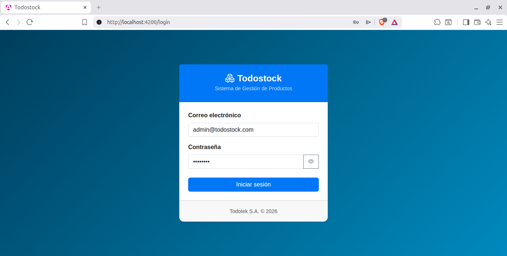
> Pantalla de autenticación con validación reactiva y manejo de errores.

### Gestión de Productos
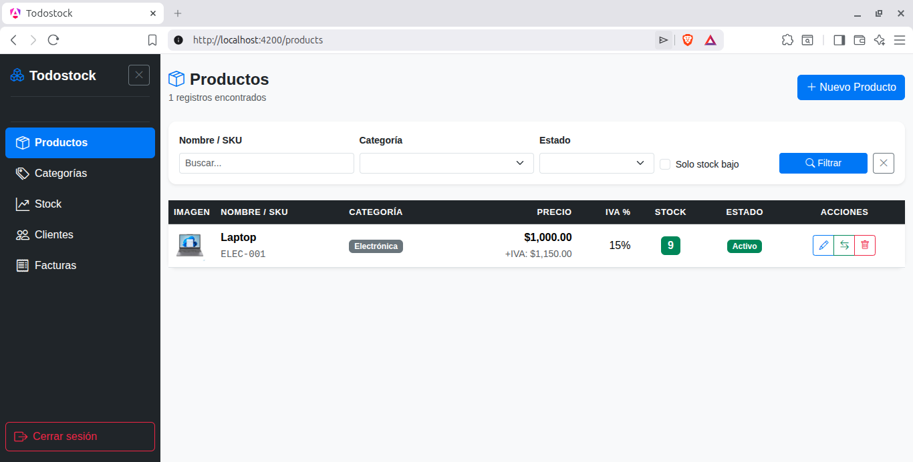
> Tabla con filtros por nombre, SKU, categoría y stock bajo. Paginación server-side.

### Modal — Crear / Editar Producto
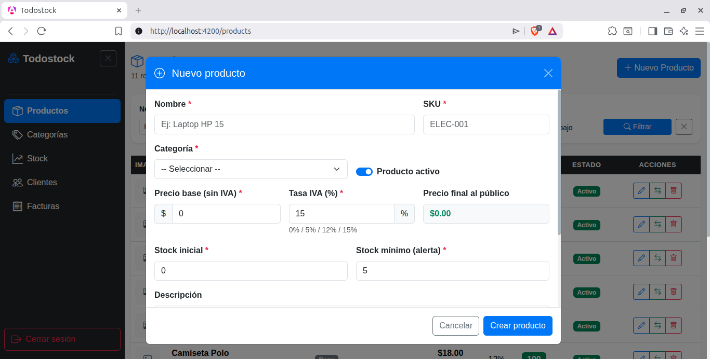
> Formulario modal con preview de precio final (IVA incluido) y upload múltiple de imágenes.

### Control de Stock
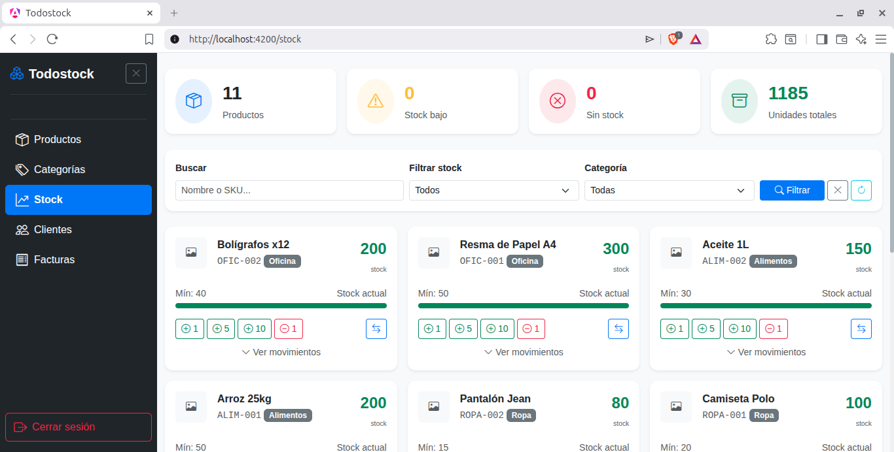
> Modal de entrada / salida / ajuste con preview del stock resultante antes de confirmar.

### Alerta de Stock Bajo (SweetAlert2)
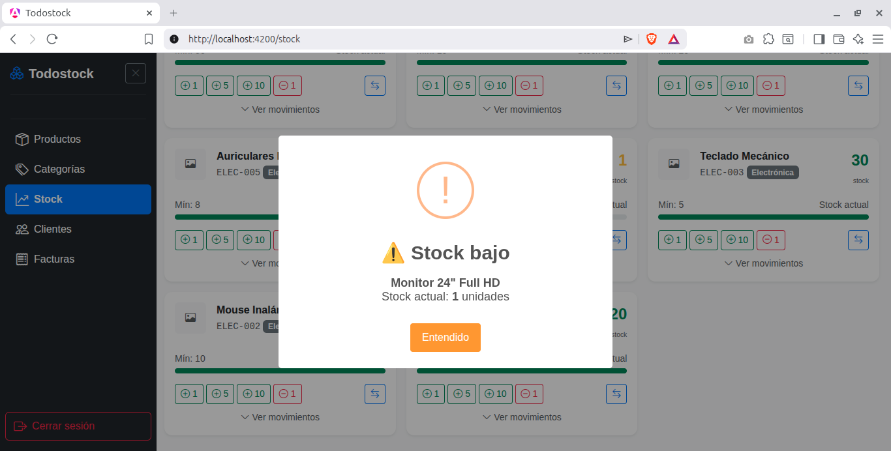
> Notificación automática cuando el stock queda por debajo del mínimo configurado.
> 
### Gestión de Clientes
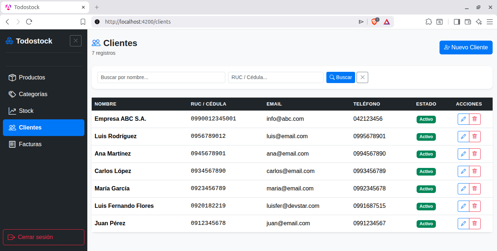
> CRUD completo con búsqueda por nombre y RUC/cédula.

### Listado de Facturas
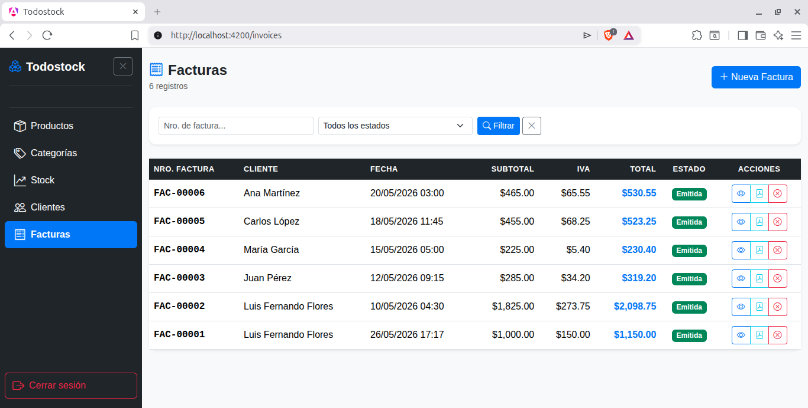
> Historial de facturas con filtros por estado y número. Modal de detalle completo.

### Nueva Factura
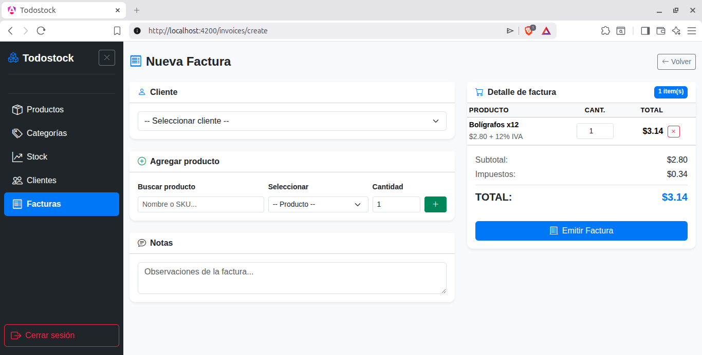
> Carrito de productos con cálculo automático de subtotal, IVA y total en tiempo real.
> 
### Descarga PDF de Factura
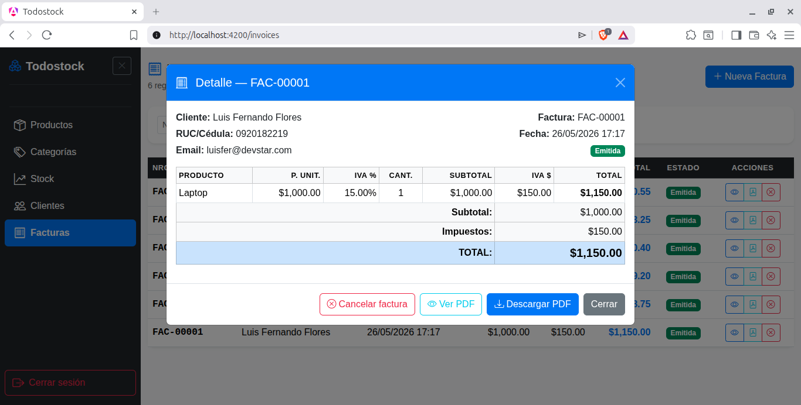
> Generación y descarga de facturas en PDF listas para impresión.

### Dashboard Técnico Backend
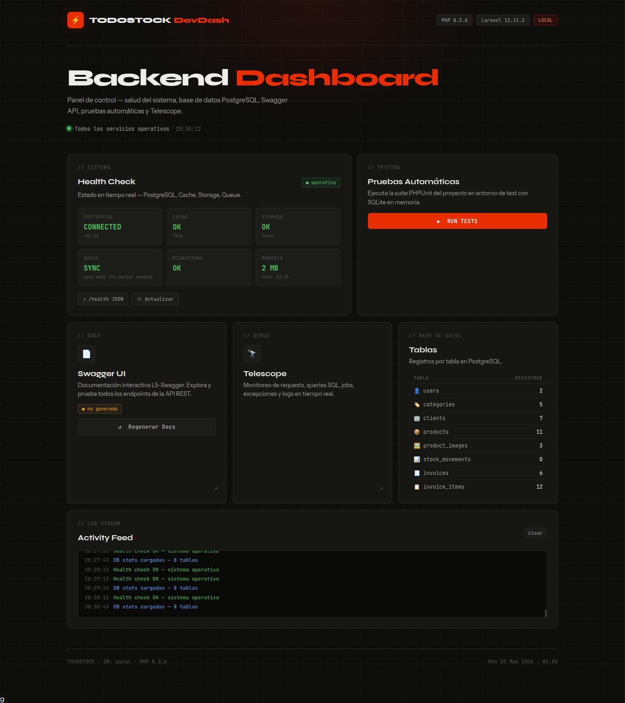
> Monitoreo de estado de base de datos, almacenamiento y servicios críticos.

### Laravel Telescope
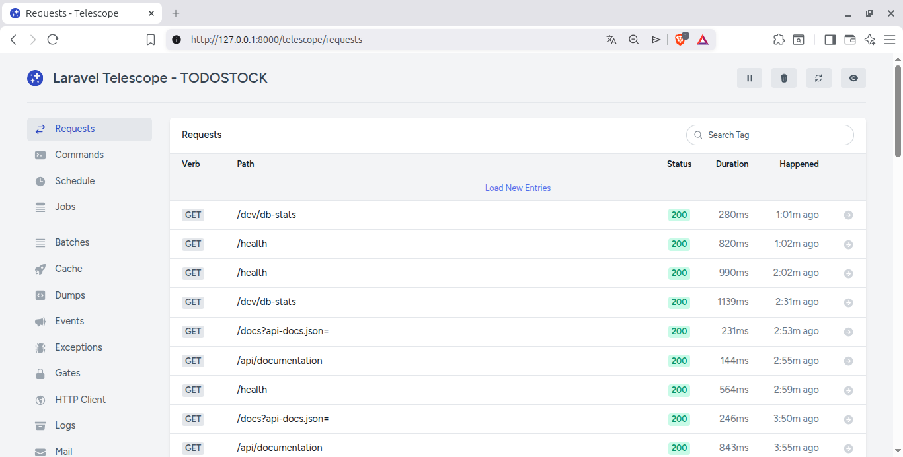
> Panel de debug con requests, queries SQL y logs en tiempo real.

### Swagger UI — Documentación de API
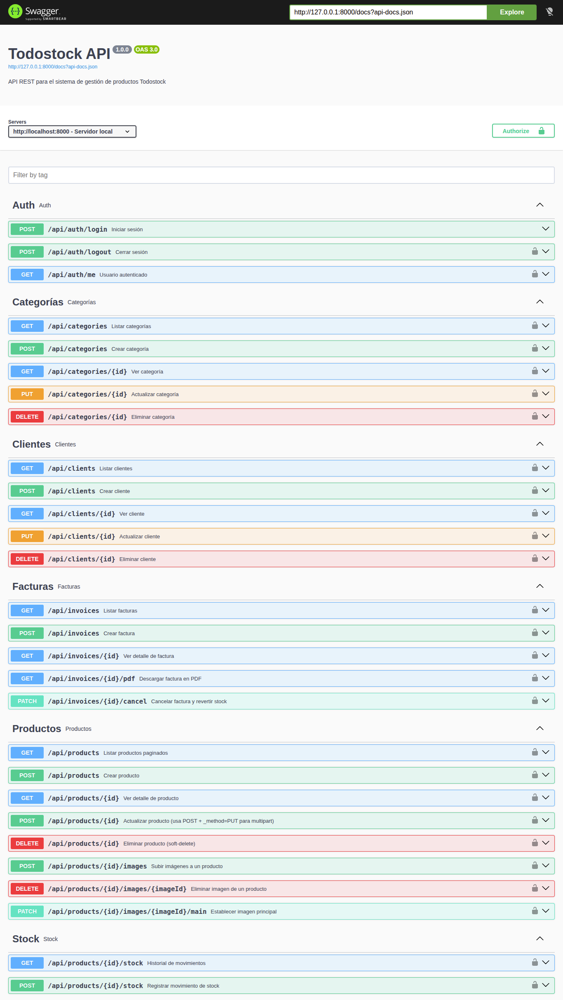
> Documentación interactiva en `/api/documentation`. Permite probar endpoints directamente.
---

## 🗂️ Estructura del repositorio

```
TodoTek_SA/
├── backend/          ← API REST en Laravel 13
│   ├── app/
│   │   ├── Http/Controllers/Api/   ← 7 controllers
│   │   ├── Models/                 ← 8 modelos Eloquent
│   │   └── Services/               ← 4 servicios de negocio
│   ├── database/
│   │   ├── migrations/             ← 8 migraciones PostgreSQL
│   │   └── seeders/                ← Datos de prueba
│   └── routes/api.php              ← Rutas protegidas con Sanctum
│
├── frontend/         ← SPA en Angular 19
│   └── src/app/
│       ├── core/                   ← Guard, Interceptor, Services, Models
│       ├── features/               ← Auth, Products, Categories, Clients, Invoices
│       └── layout/                 ← Sidebar + Shell principal
│
└── docs/
    ├── screenshots/                ← Capturas de pantalla del sistema
    ├── Todostock_v2.postman_collection.json
    ├── Todostock.postman_environment.local.json
    ├── Todostock.postman_environment.staging.json
    └── Todostock_Documentacion_Tecnica.docx
```

---

## ⚡ Quick Start

### Requisitos
- PHP 8.3+
- Composer 2.x
- Node.js 18+
- PostgreSQL 15+
- Angular CLI 19: `npm install -g @angular/cli@19`

### 1. Base de datos
```bash
psql -U postgres -c "CREATE DATABASE todostock_db;"
```

### 2. Backend
```bash
cd backend
composer install
cp .env.example .env
php artisan key:generate
```

Editar `backend/.env`:
```env
DB_CONNECTION=pgsql
DB_HOST=127.0.0.1
DB_PORT=5432
DB_DATABASE=todostock_db
DB_USERNAME=postgres
DB_PASSWORD=tu_password

SANCTUM_STATEFUL_DOMAINS=localhost:4200
FRONTEND_URL=http://localhost:4200
FILESYSTEM_DISK=public
L5_SWAGGER_GENERATE_ALWAYS=true
```

```bash
php artisan vendor:publish --provider="Laravel\Sanctum\SanctumServiceProvider"
php artisan migrate --seed
php artisan storage:link
php artisan serve
# → http://localhost:8000
```

### 3. Frontend
```bash
cd frontend
npm install
npm start
# → http://localhost:4200
```

---

## 🔐 Credenciales de prueba

| Campo    | Valor               |
| -------- | ------------------- |
| Email    | admin@todostock.com |
| Password | password            |

---

## 🧪 Probar la API

### Opción A — Swagger UI
```
http://localhost:8000/api/documentation
```

### Opción B — Postman
1. Importar `docs/Todostock_v2.postman_collection.json`
2. Importar `docs/Todostock.postman_environment.local.json`
3. Seleccionar environment **"Todostock — Local"**
4. Ejecutar **Login ⭐** — el token se guarda automáticamente
5. Todos los demás requests funcionan encadenados

---

## ✅ Funcionalidades implementadas

| Módulo             | Funcionalidad                                                      |
| ------------------ | ------------------------------------------------------------------ |
| **Auth**           | Login/logout con Sanctum, Bearer token, guard de rutas Angular     |
| **Productos**      | CRUD completo, filtros, paginación server-side, imágenes múltiples |
| **Stock**          | Entradas / Salidas / Ajustes con auditoría completa                |
| **Categorías**     | CRUD con auto-generación de slug                                   |
| **Clientes**       | CRUD, SoftDelete, validación RUC/cédula único                      |
| **Facturación**    | Carrito, cálculo IVA por producto, número secuencial FAC-00001     |
| **Cancelación**    | Cancelar factura revierte stock automáticamente                    |
| **Notificaciones** | SweetAlert2 en eliminaciones, stock bajo, cancelaciones            |
| **Swagger**        | Documentación interactiva de la API                                |
| **Telescope**      | Panel de debug en desarrollo                                       |

---

## 🏗️ Arquitectura

```
Angular SPA (localhost:4200)
        │
        │  HTTP + Bearer Token (AuthInterceptor)
        ▼
Laravel API REST (localhost:8000/api)
        │  Middleware auth:sanctum
        │  Controllers → Services → Models
        ▼
PostgreSQL (todostock_db)
        8 tablas con FK, SoftDeletes e índices
        │
        └── storage/app/public/products/
                Imágenes de productos
```

---

## 📋 Decisiones técnicas

| Decisión                   | Detalle                                                            |
| -------------------------- | ------------------------------------------------------------------ |
| **IVA configurable**       | `tax_rate` por producto (0%, 5%, 12%, 15%) — no constante global   |
| **Snapshot en facturas**   | `invoice_items` guarda precio e IVA al momento de vender           |
| **SoftDeletes**            | `products` y `clients` no se eliminan físicamente                  |
| **Auditoría de stock**     | `stock_movements` registra usuario, cantidad y stock antes/después |
| **Paginación server-side** | Eloquent `paginate(15)` — Angular nunca carga todo                 |
| **Standalone components**  | Angular 19 sin NgModules, lazy loading por feature                 |
| **Proxy dev**              | `proxy.conf.json` evita CORS en localhost durante desarrollo       |

---

## 📁 Documentación adicional

- [`backend/README.md`](backend/README.md) — Guía completa del backend Laravel
- [`frontend/README.md`](frontend/README.md) — Guía completa del frontend Angular
- [`docs/Todostock_Documentacion_Tecnica.docx`](docs/Todostock_Documentacion_Tecnica.docx) — Documentación de arquitectura

---

## 📬 Contacto

Desarrollado por **Luis Fernando Flores** como parte del proceso de selección para Todotek S.A.